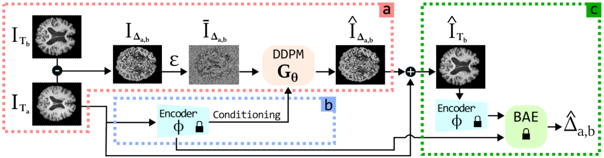

# TADM: Temporally-Aware Diffusion Model for Neurodegenerative Progression on Brain MRI (MICCAI 2024)

This is the official implementation of the MICCAI 2024 paper "**TADM: Temporally-Aware Diffusion Model for Neurodegenerative Progression on Brain MRI**" - _Mattia Litrico, Francesco Guarnera, Valerio Giuffrida, Daniele Ravì, Sebastiano Battiato_.

(https://arxiv.org/abs/2406.12411)

## Abstract

Generating realistic images to accurately predict changes in the structure of brain MRI is a crucial tool for clinicians. Such applications help assess patients' outcomes and analyze how diseases progress at the individual level. However, existing methods for this task present some limitations. Some approaches attempt to model the distribution of MRI scans directly by conditioning the model on patients' ages, but they fail to explicitly capture the relationship between structural changes in the brain and time intervals, especially on age-unbalanced datasets. Other approaches simply rely on interpolation between scans, which limits their clinical application as they do not predict future MRIs. To address these challenges, we propose a Temporally-Aware Diffusion Model (TADM), which introduces a novel approach to accurately infer progression in brain MRIs. TADM learns the distribution of structural changes in terms of intensity differences between scans and combines the prediction of these changes with the initial baseline scans to generate future MRIs. Furthermore, during training, we propose to leverage a pre-trained Brain-Age Estimator (BAE) to refine the model's training process, enhancing its ability to produce accurate MRIs that match the expected age gap between baseline and generated scans. Our assessment, conducted on the OASIS-3 dataset, uses similarity metrics and region sizes computed by comparing predicted and real follow-up scans on 3 relevant brain regions. TADM achieves large improvements over existing approaches, with an average decrease of 24% in region size error and an improvement of 4% in similarity metrics. These evaluations demonstrate the improvement of our model in mimicking temporal brain neurodegenerative progression compared to existing methods. Our approach will benefit applications, such as predicting patient outcomes or improving treatments for patients.

## Data Preparation

1. Please download the already prepared data at this link and put it under ```${DATA_ROOT}```.
2. In the file configs/oasis.yaml change "PATH_TO_DATA" with ```${DATA_ROOT}```.

##  Training

The proposed pipeline needs the training of three models: the encoder, the BAE and the DDPM. This code support Wandb for logging.



###  Training the encoder

To train the encoder use the following command:
```
# train the encoder
python tasks/trainer.py --config configs/rrdb/oasis_pretrain.yaml --exp_name rrdb_Oasis --reset --wandb
```
###  Training the BAE model
To train the BAE model use the following command:
```
# train the BAE model
python tasks/trainer.py --config configs/bae_oasis.yaml --exp_name bae_Oasis --hparams=rrdb_ckpt=checkpoints/rrdb_Oasis --reset --wandb
```

###  Training the DDPM
To train the DDPM use the following command:
```
# train the DDPM model
python tasks/trainer.py --config configs/diffsr_oasis.yaml --exp_name diffsr_Oasis --hparams=rrdb_ckpt=checkpoints/rrdb_Oasis --hparams=bae_ckpt=checkpoints/bae_Oasis --reset --wandb
```

## Inference
To make inference on the test dataset use the following command:
```
# testing the DDPM model
python tasks/trainer.py --config configs/diffsr_oasis.yaml --exp_name srdiff_pretrained_Oasis --hparams=bae_ckpt=checkpoints/bae_Oasis --infer 
```
## Citing

If you want to cite our work, please use the following bibtex:

```
@inproceedings{litrico_2024_MICCAI,
  title={TADM: Temporally-Aware Diffusion Model for Neurodegenerative Progression on Brain MRI},
  author={Litrico, Mattia and Guarnera, Francesco and Giuffrida, Valerio and Ravì, Daniele and Battiato, Sebastiano},
  booktitle={Medical Image Computing and Computer Assisted Intervention - {MICCAI}},
  year={2024}
}
```

### License

GNU GENERAL PUBLIC LICENSE 
Version 3, 29 June 2007
Copyright © 2007 Free Software Foundation, Inc. <http://fsf.org/>
